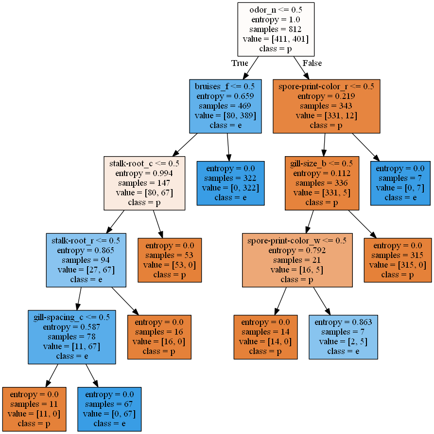

## The Data
Taken from Kaggle ([See here](https://www.kaggle.com/uciml/mushroom-classification/data)), the data contains more than 8000 different mushrooms species, each having 23 attributes, all relating to the physical observation of a mushroom species. In addition, the data also indicates whether a species of mushroom is either poisonous or edible.

### Features
23 categorical features for each observation in this following format:
Feature Information: 

cap-shape: bell=b,conical=c,convex=x,flat=f, knobbed=k,sunken=s

cap-surface: fibrous=f,grooves=g,scaly=y,smooth=s

cap-color: brown=n,buff=b,cinnamon=c,gray=g,green=r,pink=p,purple=u,red=e,white=w,yellow=y

bruises: bruises=t,no=f

odor: almond=a,anise=l,creosote=c,fishy=y,foul=f,musty=m,none=n,pungent=p,spicy=s

gill-attachment: attached=a,descending=d,free=f,notched=n

gill-spacing: close=c,crowded=w,distant=d

gill-size: broad=b,narrow=n

gill-color: black=k,brown=n,buff=b,chocolate=h,gray=g, green=r,orange=o,pink=p,purple=u,red=e,white=w,yellow=y

stalk-shape: enlarging=e,tapering=t

stalk-root: bulbous=b,club=c,cup=u,equal=e,rhizomorphs=z,rooted=r,missing=?

stalk-surface-above-ring: fibrous=f,scaly=y,silky=k,smooth=s

stalk-surface-below-ring: fibrous=f,scaly=y,silky=k,smooth=s

stalk-color-above-ring: brown=n,buff=b,cinnamon=c,gray=g,orange=o,pink=p,red=e,white=w,yellow=y

stalk-color-below-ring: brown=n,buff=b,cinnamon=c,gray=g,orange=o,pink=p,red=e,white=w,yellow=y

veil-type: partial=p,universal=u

veil-color: brown=n,orange=o,white=w,yellow=y

ring-number: none=n,one=o,two=t

ring-type: cobwebby=c,evanescent=e,flaring=f,large=l,none=n,pendant=p,sheathing=s,zone=z

spore-print-color: black=k,brown=n,buff=b,chocolate=h,green=r,orange=o,purple=u,white=w,yellow=y

population: abundant=a,clustered=c,numerous=n,scattered=s,several=v,solitary=y

habitat: grasses=g,leaves=l,meadows=m,paths=p,urban=u,waste=w,woods=d

### Class
final categorization of a mushroom is binary:
(classes: edible=e, poisonous=p)

## The methodology
Machine learning allows us to use techniques to study a training data set and subsequently predict the class of future data not in the training data set.
In particular for this session, we will use 10%-70% of 8000 mushroom species observations for training, and the rest to test for the prediction accuracy of different machine learning alogrithms.
We will be be using 4 classifier machine learning techniques from the scikit-learn python package:
- Simple Decision Tree
- Logistic Regression
- Naive Bayes
- K Nearest Neighbours

In addition, due to the large amount of features for each observation, we be subjecting the data to feature selection and feature extraction. There are 3 kinds of feature selection - filter, wrapper and embedded methods. In the 5 algorithms mentioned above, some already have implicit feature selection steps while others require some preprocessing feature selection.

## The preprocessing - part 1
We first convert all categorical features into dummy variables. [See why we need to do this](https://stats.stackexchange.com/questions/115049/why-do-we-need-to-dummy-code-categorical-variables) 
To prevent multicollinearity and high correlation between features, we will also have to do further feature selection (See preprocessing part 2 later)

### Simple Decision Tree
Training set: 10%
Test set: 90%
Prediction accuracy: 99.37%

Decision trees contain implicit feature selection. In fact, the alogrithm itself focuses on feature selection - it selects a few features which allow us to decide on the final classification of a certain mushroom data. [See here for more information on the library package](http://scikit-learn.org/stable/modules/generated/sklearn.tree.DecisionTreeClassifier.html#sklearn.tree.DecisionTreeClassifier)

To decide what features to select in the tree, we use the information gain criterion - [See here under Metrics - Information gain](https://en.wikipedia.org/wiki/Decision_tree_learning). Intuitively, the information gain criterion dictates which features allow us to gain the most insight from - for example, if likelihood of a poisonous mushroom to have thin stalk or fat stalk is around the same, the feature of stalk size does not give us much information; on the other hand, if 95% of poisonous mushooms have thin stalks, then the fature of stalk size give us more information gain.

Deciding on the size of the decision tree is important as well - we set the depth of the tree to log(total number of features) to prevent overfitting. There are other methods to prune the size of a decision tree such as tree-pruning. However, because setting the max depth of the tree to 5 already gives remarkably good results, we will not be implementing tree-pruning here.

This is the pyplot visualisation of the tree created from the data:

   

 
Now, Note the features included in the decision tree - this subset of features will be explored again later on as possible pre-selected features for another algorithm.

## The preprocessing - part 2
Other algorithms, unlike decision trees, may not contain implicit feature selection. Thus, because we now have 116 features - all dummy variables, we do not want to fall into the [dummy variable trap](http://www.algosome.com/articles/dummy-variable-trap-regression.html) for linear predictive models.

Now, we calculate the [Variance Inflation Factor(VIF)](https://en.wikipedia.org/wiki/Variance_inflation_factor), an indicator for collinearity between variables, and the correlation matrix amongst variables. Setting VIF to 10, we are able to remove a further 6 features. Moreover, setting the correlation threshold to 0.9 allows us to remove a further 7 features.

### Logistic Regression
Training set: 10%
Test set: 90%
Prediction accuracy: 99.63%

After removing collinear variables and correlated variables, we then subject the features to Logistic Regression to predict the probability that the mushroom belongs to either result class. The logistic regression model is set with L2 regularization penalty.

### Naive Bayes Algorithm
Training set: 10%
Test set: 90%
Prediction accuracy: 93.72% (With correlation threshold removal = 0.9)

Naive Bayes Algorithm assumes independence between each feature. Subsequently, it capitalises on the conditional probability of each individual feature given the class in the training data to generate the conditional probability of the predicted class given the observed test data features (Using [Bayes Formula](https://en.wikipedia.org/wiki/Naive_Bayes_classifier)).

Now, subtlety exists according to the individual distribution of the features - P(feature x = value | Class A) can only be computed if we are aware of the distribution of a feature x. This gives rise to 3 explicit ways to compute this conditional probability (also know as [Posterior probability](https://en.wikipedia.org/wiki/Posterior_probability)):
- Guassian Naive Bayes - if features are continuous and assumed to follow a normal distribution
- Multinomial Naive Bayes - if multiplie features are categorical and each assumes to take finite possible values
- Bernoulli Naive Bayes - if features can only take two possible values

Since we are using dummy variables for our features, we use bernoulli naive bayes to model the absence and presence of a feature (i.e a certain characteristic of a mushroom e.g whether odour is present)

Now, because Naive Bayes assumes independence between features, we **would** expect the accuracy of this algorithm to be lower than other ML algorithms. Now, if we reduce the correlation threshold removal for feature selection to 0.75, we increase the prediction accuracy to 94.11%. This makes sense because moderate to high correlation between variables indicates non-independence - a violation of the independence assumption for Naive Bayes. Removing even moderately correlated variables would bolster the accuracy.

### K Nearest Neighbours
Training set: 30%
Test set: 70%
Prediction accuracy: 99.9% (With PCA variance cumulative ratio = 0.9)

Given a predefined integer K, [K Nearest Neighbour](https://en.wikipedia.org/wiki/K-nearest_neighbors_algorithm) searches for K datapoints that are defined 'nearest' to a test datapoint and returns the most probably classification of the test datapoint. In our case, because all features are of binary values, we use the manhattan distance as a measure of closeness between datapoints.

#### Feature Extraction
However, KNN algorithm suffers from the curse of dimensionality - in high dimensional data, all objects appear to be sparse and dissimilar in many ways, which prevents an effective model to be created. We attempt to solve this with feature extraction.
Setting the cumulative variance ratio to 0.9 (that is, the new components created via PCA would account for 90% of the variance in the original data), we use [Principle Component Analysis](https://en.wikipedia.org/wiki/Principal_component_analysis) to reduce the number of features to 30. 
After that, KNN algorithm is run over the test set to give the above prediction accuracy.

